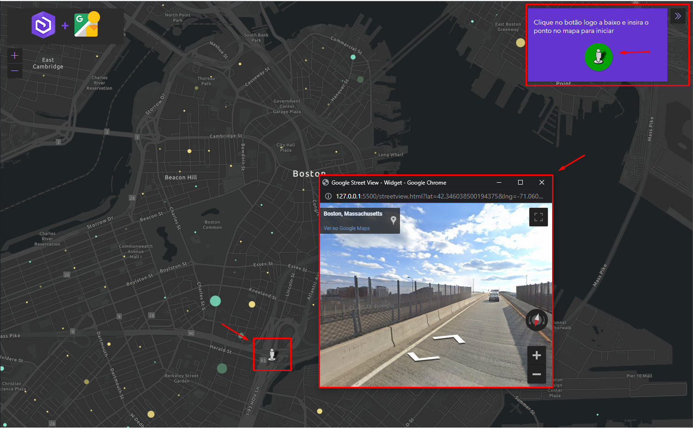

## 🚀 Google Street View Widget Integrated in <i>Arcgis API for Javascript </i>

  <i>
   Esté é um protótipo para Widget do Google Street View Integrado a Arcgis API for Javascript 
  </i>

<h3>🏆 Principais Características</i> </h3>

- Exibe o panorama do Google Street View em Janela Modal;
- Recupera a coordenada geográfica no mapa Arcgis e envia para a API do Google Street View;
- A mudança de eventos é bidirecional, as ações no panorama refletem no Avatar do mapa e as ações de clique no mapa refletem no panorama;
- Fácil Intergração;
- Testado nas versões 4.17 ou superior do Arcgis API for Javascript.
